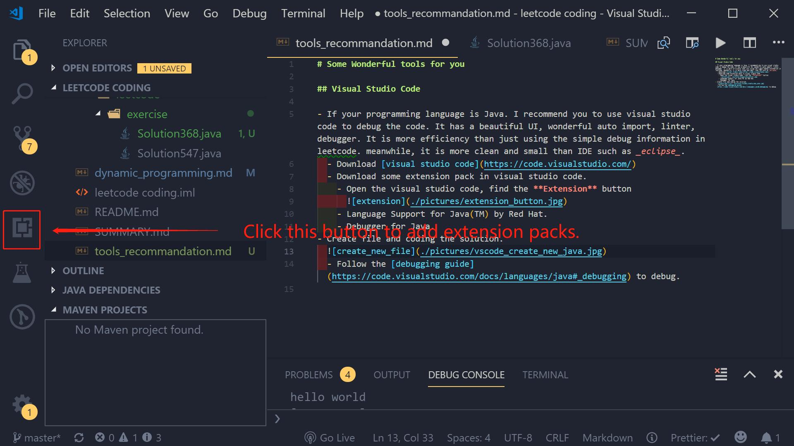
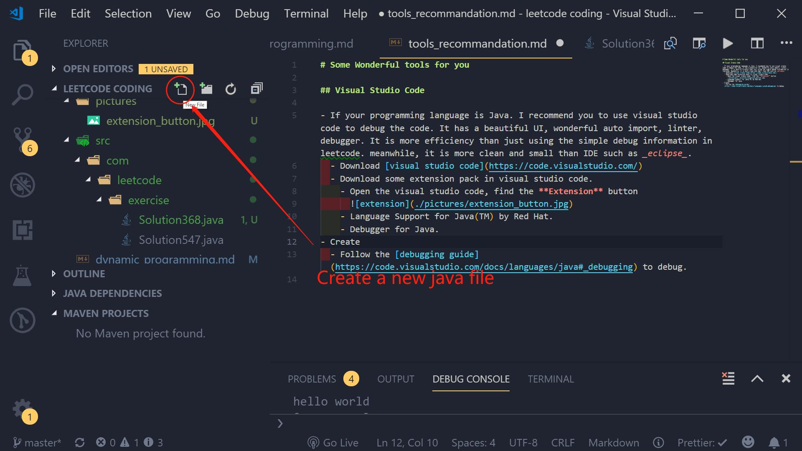
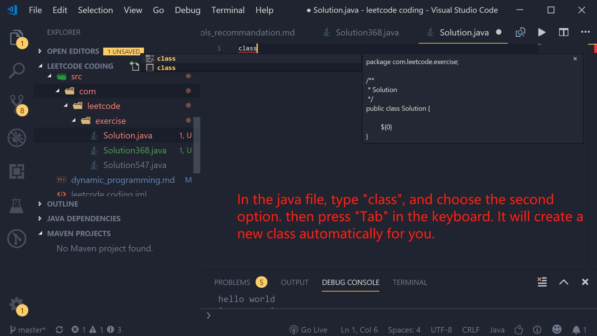

# Some Wonderful tools for you

## Visual Studio Code

- If your programming language is Java. I recommend you to use visual studio code to debug the code. It has a beautiful UI, wonderful auto import, linter, debugger. It is more efficiency than just using the simple debug information in leetcode. meanwhile, it is more clean and small than IDE such as _eclipse_.

  - Download [visual studio code](https://code.visualstudio.com/)
  - Download some extension pack in visual studio code.
    - Open the visual studio code, find the **Extension** button
      <!--  <br> -->
      <br>
    - Language Support for Java(TM) by Red Hat.
    - Debugger for Java.
  - Create file and coding the solution.

    <!--  <br> -->
    

    <!--  <br> -->
    

    The simple code structure <br>

    ```java
        package com.leetcode.exercise;

    import java.util.*;

    /**
     * Solution368
     */
    public class Solution368 {

        public static void main(String[] args) {
            Solution368 solution = new Solution368();
            List<Integer> result = solution.largestDivisibleSubset(new int[] { 4, 8, 10, 240 });
            System.out.println(result);
        }

        public List<Integer> largestDivisibleSubset(int[] nums) {
            if (nums == null || nums.length == 0)
                return new ArrayList<Integer>();
            int length = nums.length;
            Arrays.sort(nums);
            List<Integer>[] dp = new ArrayList[length];
            for (int i = 0; i < length; i++) {
                dp[i] = new ArrayList<Integer>();
            }
            dp[0].add(nums[0]);
            for (int i = 1; i < length; i++) {
                for (int j = i - 1; j >= 0; j--) {
                    if (nums[i] % nums[j] == 0 && dp[j].size() > dp[i].size()) {
                        dp[i].clear();
                        dp[i].addAll(dp[j]);
                        // break;
                    }
                }
                dp[i].add(nums[i]);
            }

            int max_length = Integer.MIN_VALUE;
            List<Integer> result = new ArrayList<Integer>();
            for (int i = 0; i < length; i++) {
                if (dp[i].size() > max_length) {
                    max_length = dp[i].size();
                    result = dp[i];
                }
            }
            return result;
        }
    }
    ```

- Follow the [debugging guide](https://code.visualstudio.com/docs/languages/java#_debugging) to debug.
